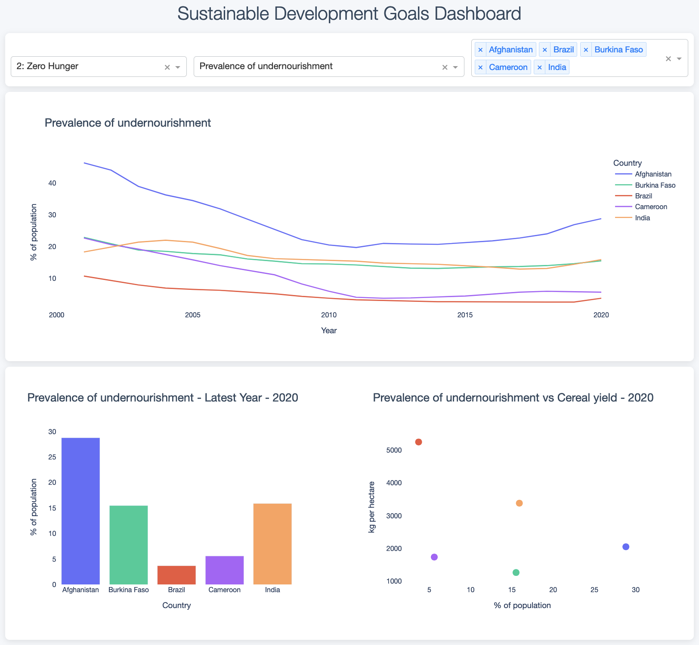

# World Bank Data Pipeline

## Project Overview
This data engineering solution automates the retrieval, processing, storage, and visualization of World Bank development data. It demonstrates a robust, scalable approach to constructing data pipelines for economic analysis and business intelligence applications. The pipeline is orchestrated using Apache Airflow, ensuring automated, scheduled updates and efficient data management.

## Key Features
- Asynchronous data retrieval from the World Bank API
- Customizable selection of economic indicators and countries
- Comprehensive error handling and logging mechanisms
- Modular architecture facilitating maintenance and testing
- Efficient data processing and cleaning utilizing pandas
- Automated data quality checks and validation
- Dynamic visualization of development trends using an interactive dashboard
- Automated workflow orchestration with Apache Airflow
- MongoDB integration for efficient data storage and retrieval
- Regular, automated updates to ensure data freshness

## Dashboard Example


## Technical Architecture

```
world_bank_data/
│
├── airflow/
│   └── dags/
│       └── wbd_dag.py
│
├── src/
│   ├── __init__.py
│   ├── api.py                # API interaction module
│   ├── indicators_config.py  # Indicator theme dictionary
│   ├── data_processor.py     # Data transformation module
│   ├── pipeline.py           # Core pipeline logic
│   ├── dashboard.py          # For data visualization
│   ├── exceptions.py         # Exception handling
│   └── database.py           # MongoDB interactions
│
├── tests/
│   ├── __init__.py 
│   ├── test_api.py
│   ├── test_data_processor.py
│   ├── test_pipeline.py
│   ├── test_dashboard.py
│   └── test_database.py
│
├── config.py                # Configuration parameters
├── main.py                  # Pipeline execution entry point
└── requirements.txt         # Dependency specifications
```

## Prerequisites

- Python 3.7+
- Apache Airflow 2.0+
- MongoDB
- Dependencies: aiohttp, pandas, dash, plotly (full list in requirements.txt)

## Installation and Setup

1. Clone the repository:
   ```
   git clone https://github.com/hraym/DataPipeline.git
   ```
2. Navigate to the project directory:
   ```
   cd DataPipeline
   ```
3. Install required packages:
   ```
   pip install -r requirements.txt
   ```
4. Set up MongoDB and update the connection details in `config.py`
5. Configure Airflow and place the `wbd_dag.py` file in your Airflow DAGs folder

## Usage

Execute the main script with desired parameters:

```bash
python main.py --indicators <indicator_codes> --countries <country_codes> --start_year <start> --end_year <end> --visualize
```

Example:
```bash
python3 main.py --indicators EG.ELC.ACCS.ZS SN.ITK.DEFC.ZS --countries BRA IND KEN --start_year 2000 --end_year 2020 --visualize
```
## Automated Execution with Airflow
The pipeline is configured to run automatically on a monthly schedule using Airflow. The DAG performs the following tasks:

- Check for missing data in the MongoDB database
- Fetch any missing data from the World Bank API
- Update the database with new data
- Generate an updated dashboard

To enable the automated workflow:

- Ensure Airflow is properly configured
- Place the wbd_dag.py file in your Airflow DAGs folder
- Enable the DAG in the Airflow UI

## Testing and Quality Assurance

Execute the test suite:

```bash
pytest tests/
```

## Data Visualization Capabilities

The pipeline creates an interactive dashboard showcasing the progress of selected World Bank indicators over time. The dashboard includes:

### Time series plots for each indicator

Comparative bar charts for the latest available year
Scatter plots to visualize relationships between indicators


## Extensibility and Customization

The modular design allows for easy integration of additional data sources, processing steps, or analytical models. Customization can be achieved by modifying the relevant modules or extending the pipeline class. The Airflow DAG can also be customized to adjust the update frequency or add additional tasks as needed.

## Performance Considerations

The asynchronous data fetching mechanism ensures efficient retrieval of large datasets.
MongoDB provides fast data storage and retrieval for the dashboard.
For very large data volumes or real-time processing needs, consider implementing a distributed processing framework.

## Security and Compliance

Data is processed locally and stored in MongoDB, ensuring compliance with data protection regulations.
Implement appropriate access controls and encryption if deploying in a multi-user or cloud environment.
Ensure that your Airflow installation is properly secured, especially if exposed to the internet.

## License

This project is licensed under the Creative Commons Attribution 4.0 International License (CC BY 4.0). This means you are free to:

Share — copy and redistribute the material in any medium or format
Adapt — remix, transform, and build upon the material for any purpose, even commercially

Under the following terms:

Attribution — You must give appropriate credit, provide a link to the license, and indicate if changes were made. You may do so in any reasonable manner, but not in any way that suggests the licensor endorses you or your use.

## Acknowledgements

- World Bank for providing the data API
- Open-source community for the tools and libraries utilized in this project

## Contact Information

For inquiries or support, please contact:

Harry Raymond - harryraym@gmail.com